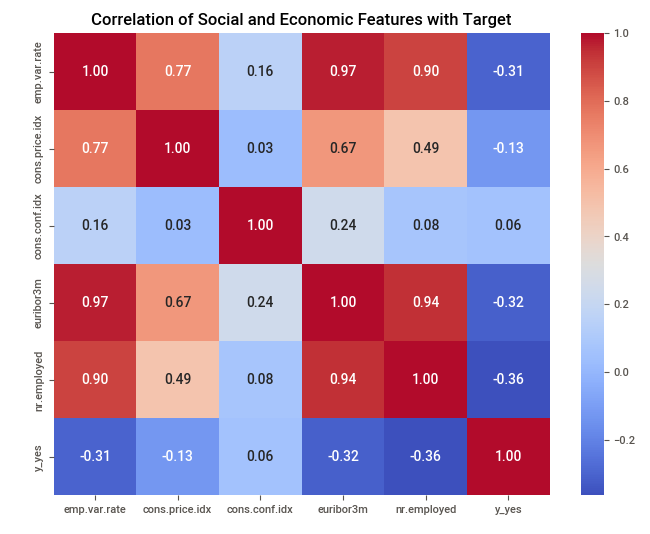
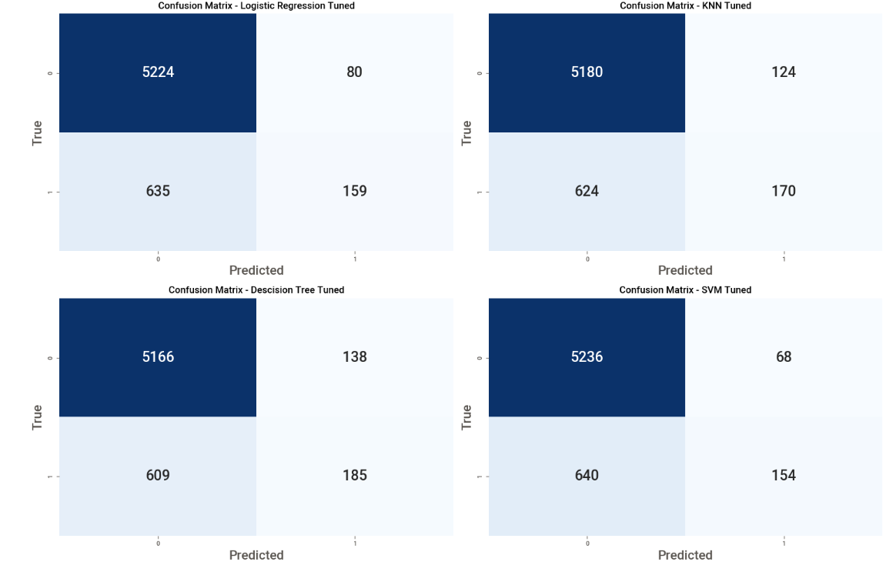
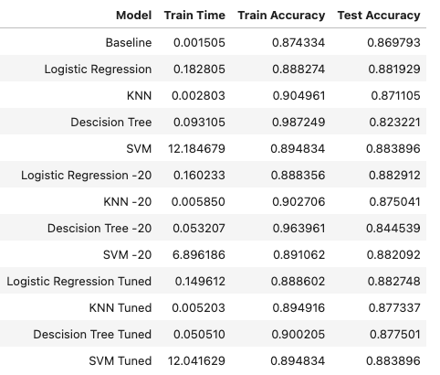

# Portugese Bank Direct Marketing Campaign Report
Using a dataset related to marketing bank products over the telephone, classification models are created to determine what are the important factors that drives campaign effectiveness. We found that the top 4 conditions for a successful campaign are number of employees, previous contact success, euribor 3 month rate and consumer confidence index.

## Data Description
Dataset comes from the UCI Machine Learning repository [link](https://archive.ics.uci.edu/dataset/222/bank+marketing).

Data is from call center of a Portuguese bank. Marketers telephoned contacts for 17 campaigns that ran between May 2008 and November 2010. Campaigns for long-term deposit with good interest rate had a 8% success rate, having 6,499 subscribed out of 79,354 contacted.

#### Bank Client Data
```
1 - age (numeric)
2 - job : type of job (categorical: 'admin.','blue-collar','entrepreneur','housemaid','management','retired','self-employed','services','student','technician','unemployed','unknown')
3 - marital : marital status (categorical: 'divorced','married','single','unknown'; note: 'divorced' means divorced or widowed)
4 - education (categorical: 'basic.4y','basic.6y','basic.9y','high.school','illiterate','professional.course','university.degree','unknown')
5 - default: has credit in default? (categorical: 'no','yes','unknown')
6 - housing: has housing loan? (categorical: 'no','yes','unknown')
7 - loan: has personal loan? (categorical: 'no','yes','unknown')
```
#### Last Contact of the Current Campaign
```
8 - contact: contact communication type (categorical: 'cellular','telephone')
9 - month: last contact month of year (categorical: 'jan', 'feb', 'mar', ..., 'nov', 'dec')
10 - day_of_week: last contact day of the week (categorical: 'mon','tue','wed','thu','fri')
11 - duration: last contact duration, in seconds (numeric). Important note: this attribute highly affects the output target (e.g., if duration=0 then y='no'). Yet, the duration is not known before a call is performed. Also, after the end of the call y is obviously known. Thus, this input should only be included for benchmark purposes and should be discarded if the intention is to have a realistic predictive model.
```
#### Campaign Attributes:
```
12 - campaign: number of contacts performed during this campaign and for this client (numeric, includes last contact)
13 - pdays: number of days that passed by after the client was last contacted from a previous campaign (numeric; 999 means client was not previously contacted)
14 - previous: number of contacts performed before this campaign and for this client (numeric)
15 - poutcome: outcome of the previous marketing campaign (categorical: 'failure','nonexistent','success')
```
#### Social and Economic Context Attributes
```
16 - emp.var.rate: employment variation rate - quarterly indicator (numeric)
17 - cons.price.idx: consumer price index - monthly indicator (numeric)
18 - cons.conf.idx: consumer confidence index - monthly indicator (numeric)
19 - euribor3m: euribor 3 month rate - daily indicator (numeric)
20 - nr.employed: number of employees - quarterly indicator (numeric)
```
#### Target
```
21 - y - has the client subscribed a term deposit? (binary: 'yes','no')
```
Data file: [bank-additional-full.csv](data/bank-additional-full.csv)
Data overview: [SWEETVIZ_REPORT](SWEETVIZ_REPORT.html)

## Analysis
## Observations
* Positive economic conditions increase the likelihood of long-term deposit subscription
  * Low unemployment rate - High number of employees
  * High interest rate - High Euribor 3 month rate
  * Consumer confidence - High Consumer Confidence Index
    
* Contacts who have subscribed before are more likely to subscribe again
* While month of contact shows strong influence to predict positive result, it is correlated to high interest rate

## Model Selection
#### Use Decision Tree model for prediction
* Decision Tree model yields the highest correct prediction.  Using this model, the bank can spend more resources on contacts that are likely to subscribe.  This model has the best balance of accuracy and computing resource.
* The impact of false positive is the cost of additional contacts.  Although this model has lower accuracy than Logistic Regression and SVM, if the bank is willing to spend more resources to get more subscriptions, we should use this model.  
#### Alternative Models
* Use the Logistic Regression model if resources are limited and the bank can only contact limited number of potential customers.  This model has higher accuracy and lower false positive.
* SVM model has the highest accuracy and lowest false positive, however, it takes a long time to process.  We would recommend this model if computing resources is not a concern.



## Recommendations
* Staff up and launch large campaign when unemployment rate decrease and interest rate increases are expected
* Use Decision Tree model predict and prioritize contacts who are likely to subscribe

## Next steps
* Improve model with more data points, like time of contact, savings account balance
* Experiment with evening and weekend contact
* Since low interest rate could dampen business results, create model with data during low interest rate period to see what factors can drive stronger subscriptions rates
